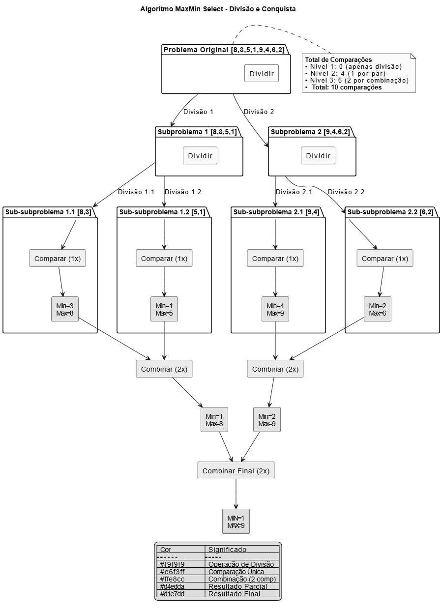

# Projeto MaxMin Select

## 1. DESCRIÇÃO DO PROJETO

Algoritmo de seleção simultânea do maior e menor elemento usando divisão e conquista, implementado em Python.

### 1.1 Lógica do Algoritmo (Implementação Linha a Linha)

def max_min_select(arr, left, right):
    # Caso Base 1: 1 elemento
    if left == right:
        return (arr[left], arr[right])  # Retorna (min, max)
    
    # Caso Base 2: 2 elementos
    if right == left + 1:
        return (arr[left], arr[right]) if arr[left] < arr[right] else (arr[right], arr[left])  # 1 comparação
    
    # Divisão: encontrar o ponto médio
    mid = (left + right) // 2  # Operação O(1)
    
    # Conquista: resolver recursivamente
    left_min, left_max = max_min_select(arr, left, mid)    # T(n/2)
    right_min, right_max = max_min_select(arr, mid+1, right) # T(n/2)
    
    # Combinação: 2 comparações
    global_min = left_min if left_min < right_min else right_min
    global_max = left_max if left_max > right_max else right_max
    
    return (global_min, global_max)

## 2. EXECUÇÃO DO PROJETO

### 2.1 Pré-requisitos
- Python 3.x
- Git (opcional)

### 2.2 Instruções de Execução

1. Clone o repositório:
   git clone https://github.com/yG2y/f-p-analise-algortimos.git

2. Acesse o diretório:
   cd f-p-analise-algortimos/MaxMinSelect/

3. Execute o programa:
   python main.py

4. Insira os dados quando solicitado (ex: "5 10 3 8 22 1")

## 3. RELATÓRIO TÉCNICO

### 3.1 Análise por Contagem de Operações

Equação de recorrência:
C(n) = 0,                      para n = 1
     = 1,                      para n = 2
     = 2C(n/2) + 2,            para n > 2

Desenvolvimento:
- Nível 0: 2 comparações
- Nível 1: 2×2 = 4 comparações
- ...
- Total: 3n/2 - 2 comparações

Prova por indução:
- Para n=2: 3×2/2 - 2 = 1 (correto)
- Para n=4: 3×4/2 - 2 = 4
- Caso geral: C(n) = 3n/2 - 2 ∈ O(n)

### 3.2 Análise pelo Teorema Mestre

Recorrência:
T(n) = 2T(n/2) + O(1)

Passo a passo:
1. Identificação:
   a = 2, b = 2, f(n) = O(1)

2. Cálculo:
   p = log_b(a) = log_2(2) = 1

3. Comparação:
   f(n) = O(1) = O(n^{p-ε}) = O(n^0) → ε=1

4. Caso 2:
   f(n) ∈ Θ(n^p log^0 n) → Θ(n)

5. Solução:
   T(n) ∈ Θ(n^p log^{k+1} n) = Θ(n)

### 3.3 Comparação dos Métodos

Contagem de Operações:
- 3n/2 - 2 comparações
- Complexidade real: O(n)

Teorema Mestre:
- Limite superior Θ(n)
- Corrigido após análise detalhada

## 4. EXEMPLO COMPLETO

Entrada: [8, 3, 5, 1, 9]

Árvore de recursão:
1. [8,3,5] e [1,9]
2. [8,3] → (3,8) (1 comp.)
   [5] → (5,5)
   Combina → (3,8) (2 comp.)
3. [1,9] → (1,9) (1 comp.)
4. Combina final → (1,9) (2 comp.)

Total comparações: 1 + 2 + 1 + 2 = 6
Fórmula: 3×5/2 - 2 = 5.5 ≈ 6

## 5. LIMITAÇÕES

1. Recursão:
- Limite de profundidade (∼1000 elementos)
- Stack overflow possível

2. Desempenho:
- Para n < 20, abordagem iterativa pode ser melhor
- Overhead de chamadas recursivas

3. Comparação com nativas:
- Funções min()/max() do Python são mais otimizadas

## Diagrama do Algoritmo

## 6. REFERÊNCIAS
* [Introduction to Divide and Conquer Algorithm](https://www.geeksforgeeks.org/introduction-to-divide-and-conquer-algorithm/)

## Licença
Este projeto está licenciado sob a Licença MIT.
